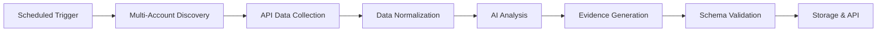

# Machine-Readable Assessment Approach

## Overview

Knox AI generates machine-readable FedRAMP assessment data that enables automated validation, continuous monitoring, and seamless integration with existing GRC platforms. Our approach prioritizes data accuracy, completeness, and accessibility through well-defined schemas and RESTful APIs.

## Data Format and Schema

### Core Structure

Our machine-readable assessment follows a structured JSON format that aligns with FedRAMP requirements:

```json
{
  "evidence": [
    {
      "Unique Evidence Number": "KSI-IAM-1",
      "KSI Type": "IAM",
      "KSI Category": "Identity and Access Management",
      "KSI Description": "Multi-factor authentication enforcement",
      "Compliance Status": "Pass",
      "Evidence Title": "MFA Configuration for All Users",
      "Evidence Collection Date": "2024-11-14T10:30:00Z",
      "Evidence Owner": "Knox AI Automated Scanner",
      "Literal Evidence": [
        {
          "type": "aws_iam_user",
          "resource": "user-123",
          "mfa_enabled": true,
          "last_validated": "2024-11-14T10:30:00Z"
        }
      ],
      "Pass/Fail Reason": "All IAM users have MFA enabled",
      "Remediation Required": "No",
      "Score": 100,
      "Data Sources": ["AWS", "Drata"]
    }
  ]
}
```

### Schema Definition

The complete schema is available at:
- **Endpoint**: `/api/compliance/fedramp-output/schema-detailed`
- **File**: [schemas/fedramp-output-schema.json](../schemas/fedramp-output-schema.json)

Key schema features:
- **Strict Validation**: JSON Schema Draft-07 compliant
- **Pattern Matching**: Evidence numbers follow `KSI-[A-Z0-9]+-(VP)?[0-9]+` pattern
- **Enumerated Types**: Predefined values for KSI types and statuses
- **Extensible Design**: Additional properties allowed for future enhancements

## Data Collection Methodology

### Three-Layer Architecture

1. **Infrastructure Layer (AWS APIs)**
   ```
   Direct API Calls → Resource Inventory → Configuration State
   ```
   - EC2 instances, security groups, VPCs
   - IAM users, roles, policies
   - S3 buckets, encryption settings
   - RDS databases, backup configurations

2. **Security Layer (Wiz CNAPP)**
   ```
   Security Scanning → Risk Assessment → Vulnerability Data
   ```
   - CVE detection and severity
   - Compliance violations
   - Attack path analysis
   - Configuration drift

3. **Governance Layer (Drata GRC)**
   ```
   Policy Compliance → Control Testing → Evidence Management
   ```
   - Control effectiveness
   - Policy adherence
   - Training records
   - Audit trails

### Evidence Collection Process



## API Endpoints

### Primary Endpoints

1. **Get FedRAMP Output**
   ```
   GET /api/compliance/fedramp-output
   ```
   Returns the complete machine-readable assessment in FedRAMP format.

2. **Get Detailed Output**
   ```
   GET /api/compliance/fedramp-output/detailed
   ```
   Includes additional metadata for debugging and audit purposes:
   - Evaluation timestamps
   - AI reasoning chains
   - Source API responses
   - Confidence scores

3. **Get Filtered Results**
   ```
   GET /api/compliance/fedramp-output/filtered?status=Fail&ksi=IAM
   ```
   Query parameters:
   - `status`: Pass, Fail, Unknown
   - `ksi`: CNA, SC, IAM, MLA, CM, PI, 3IR, CD, IR
   - `date_from`: ISO 8601 date
   - `date_to`: ISO 8601 date

### Response Format

All endpoints return:
- **Content-Type**: `application/json`
- **Encoding**: UTF-8
- **Status Codes**:
  - 200: Success
  - 400: Invalid parameters
  - 500: Server error

## Evidence Types and Sources

### Evidence Classification

1. **Technical Evidence** (Automated)
   - Resource configurations
   - Network topology
   - Access logs
   - Security settings

2. **Procedural Evidence** (AI-Validated)
   - Change management records
   - Incident response procedures
   - Training completion
   - Policy updates

3. **Operational Evidence** (Integrated)
   - Monitoring alerts
   - Vulnerability scans
   - Penetration test results
   - Audit findings

### Data Source Attribution

Each evidence item includes source attribution:

```json
"Data Sources": ["AWS", "WIZ", "Drata", "Document"],
"Source Metadata": {
  "aws_account": "123456789012",
  "aws_region": "us-east-1",
  "wiz_scan_id": "scan-xyz-123",
  "drata_control_id": "ctrl-456"
}
```

## Integration Capabilities

### Direct API Integration

```python
import requests

# Get latest FedRAMP assessment
response = requests.get('https://api.knoxsystems.com/compliance/fedramp-output')
assessment = response.json()

# Filter for failed controls
failed = [e for e in assessment['evidence'] if e['Compliance Status'] == 'Fail']
```

### Webhook Notifications

```json
POST /webhooks/compliance-update
{
  "event": "evaluation_complete",
  "timestamp": "2024-11-14T12:00:00Z",
  "summary": {
    "total_controls": 150,
    "passed": 145,
    "failed": 5,
    "unknown": 0
  },
  "details_url": "https://api.knoxsystems.com/compliance/results/eval-123"
}
```

### Export Formats

Beyond JSON, we support:
- **CSV**: For spreadsheet analysis
- **XML**: For legacy system integration
- **OSCAL**: For standardized exchange

## Continuous Updates

### Real-Time Synchronization

- **Push Updates**: WebSocket connections for live status
- **Pull Updates**: Polling endpoints for batch systems
- **Event Stream**: Server-sent events for dashboards

### Historical Tracking

```json
GET /api/compliance/history?ksi=IAM-1&days=30
{
  "evidence_number": "KSI-IAM-1",
  "history": [
    {
      "date": "2024-11-14",
      "status": "Pass",
      "score": 100
    },
    {
      "date": "2024-11-13",
      "status": "Pass",
      "score": 98
    }
  ]
}
```

## Security and Privacy

### Data Protection

- **Encryption**: TLS 1.3 for transit, AES-256 for storage
- **Authentication**: OAuth 2.0 with JWT tokens
- **Authorization**: Role-based access control
- **Audit Logging**: Every API call logged

### Sensitive Data Handling

- **PII Redaction**: Automatic removal of personal information
- **Secret Masking**: API keys and passwords never exposed
- **Data Retention**: Configurable retention policies
- **Right to Deletion**: GDPR/CCPA compliant

## Validation and Quality Assurance

### Schema Validation

Every response is validated against our published schema:
```bash
ajv validate -s fedramp-output-schema.json -d assessment-results.json
```

### Data Quality Checks

1. **Completeness**: All required fields populated
2. **Consistency**: Cross-reference validation
3. **Accuracy**: Source data verification
4. **Timeliness**: Maximum age thresholds

### 3PAO Verification

Coalfire independently validates:
- Schema compliance
- Data accuracy
- Evidence completeness
- API reliability

## Benefits of Our Approach

1. **Automation-Ready**: Direct integration with CI/CD pipelines
2. **Tool-Agnostic**: Standard JSON works with any platform
3. **Transparent**: Clear schema with full documentation
4. **Scalable**: Handles millions of resources efficiently
5. **Reliable**: 99.9% uptime with redundancy

## Future Enhancements

### Near-Term (Q1 2025)
- GraphQL API for flexible queries
- OSCAL native format support
- Real-time streaming APIs
- Advanced filtering options

### Long-Term (2025+)
- Machine learning insights
- Predictive compliance scoring
- Natural language queries
- Blockchain evidence chains

## Technical Support

For integration assistance:
- Email: fedramp20x@knoxsystems.com
- Website: www.knoxsystems.com